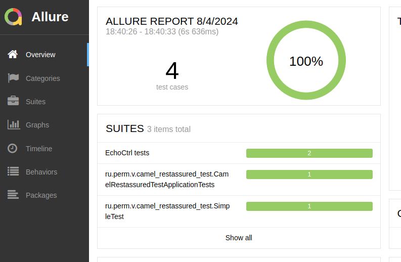

## Интеграционные RestAssured тесты для проекта camel_rest

Основной проект [https://github.com/cherepakhin/camel_rest](https://github.com/cherepakhin/camel_rest)

Переменные окружения:

__CAMEL_SIMPLE_APP_IP__ - IP адрес основного проекта. Значение по умолчанию 127.0.0.1:8980.

Проведение тестирования:

````shell
./gradlew clean test
````

или

````shell
./gradlew cleanTest test
````

или

````shell
./gradlew test --rerun-tasks
````
Причина таких мероприятий в том, что Gradle пропускает уже пройденные тесты, если код не изменился. В случае с тестирования внешнего сервися, сами тесты не меняются, а тестируюмая система может измениться. Но можно просто использовать "./gradlew test" для прогона ВСЕХ тестов, без учета предыдущих результатов. Для этого в build.gradle.kts добавлено:

````shell
tasks.withType<Test> {
....
    outputs.upToDateWhen { false } // always rerun tests
....
}
````

Просмотр Allure отчета от тестировании:

````shell
./gradlew alluServe
````

